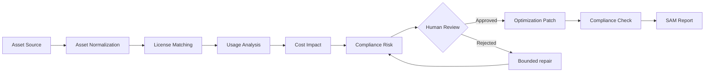

# SAM LAB

SAM LAB is a local-first visual Software Asset Management analysis studio. It turns software inventory, contracts, assignments, usage and renewal evidence into an auditable card workflow.

The application starts with a blank workbench. Cards represent reusable analysis stages—not individual applications—so one graph can evaluate an entire software portfolio without becoming an unreadable wall of assets.

## What it analyzes

- Software inventory completeness and ownership
- Purchased, assigned and active license seats
- Unused licenses and annualized waste
- Entitlement and compliance exposure
- Unapproved or unknown applications
- Renewal deadlines and optimization opportunities
- Evidence gaps that require human review

The first built-in analyzer is implemented in [`src/domain/sam.ts`](src/domain/sam.ts). It produces bounded portfolio metrics and evidence-backed findings without mutating vendor systems.

## Card workflow



Supporting cards provide catalog exploration, bounded workers, parallel analysis, decision splits, versioned monitoring and portfolio diagrams. Every material correction remains reviewable and restorable.

## Built-in scenarios

Open **Settings → Examples** to load an optional workflow:

- **License reclamation** — find inactive seats, calculate annual waste and review a reclaim plan.
- **Entitlement compliance** — compare assignments to purchased rights and route material exposure to a reviewer.
- **Renewal optimization** — prioritize upcoming renewals using spend, utilization and evidence coverage.
- **Evidence gap lab** — demonstrate how missing ownership or unreliable evidence blocks an unsafe conclusion.

Examples never replace the default blank workbench.

## Safety model

- SQLite stores workspaces, revisions and review history locally.
- Cards contain bounded evidence and summaries, not credentials or raw usage rows.
- Invalid graph candidates are rejected atomically.
- External mutations require an explicit reviewed action.
- The agent may raise risk but cannot lower deterministic host policy.
- Closing Electron stops every monitor and agent action; SAM LAB installs no hidden service.

## Technology

- React 19, TypeScript and Vite
- React Flow for the visual graph
- Electron for the desktop shell
- SQLite for local workspaces and history
- Optional MCP and HTTP catalog connectors
- Vitest for domain, renderer and Electron tests

## Run locally

Requirements: Node.js 20+ and npm.

```bash
npm install
npm run electron:dev
```

Renderer only:

```bash
npm run dev
```

Validation:

```bash
npm test
npm run build
npm run build:electron
```

## Tauri Setup installer

SAM LAB includes a lightweight Tauri launcher in `apps/bootstrap-installer`. It installs the native Electron application from the selected GitHub source:

- **Stable** installs the latest published SAM LAB release.
- **Main** installs the newest commit from `Complexity-ML/labo-sam`.

Run the Setup launcher locally:

```bash
npm install --prefix apps/bootstrap-installer
npm run setup:dev
```

Build a macOS installer:

```bash
npm run setup:build:mac
```

Build a Windows installer:

```bash
npm run setup:build:win
```

Setup downloads the selected source, builds SAM LAB locally for the current computer, replaces the application atomically and keeps one rollback copy. It does not install a background service.

## Project structure

```text
electron/          Desktop shell, SQLite and secure connector boundary
apps/bootstrap-installer/  Tauri Setup launcher for Stable and Main
src/components/    Shared cards, panels, settings and review UI
src/domain/        SAM analysis, graph contracts, presets and versioning
src/hooks/         Autonomous player and workspace orchestration
src/views/         Card library and inspector views
```

## License

Apache License 2.0. See [`LICENSE`](LICENSE).
