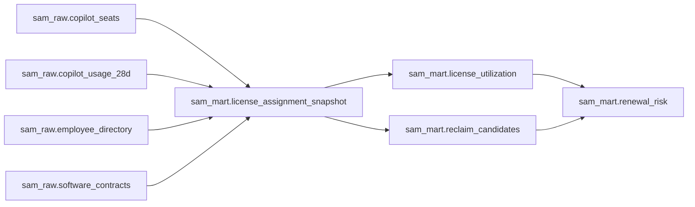

# GitHub Copilot license optimization demo

This example creates a deterministic, synthetic Software Asset Management data
product that can be ingested into DataHub and inspected by SAM LAB.

It contains 250 pseudonymized Copilot seat assignments, a 28-day aggregate
usage snapshot, organization attributes and one contract entitlement. There
are no names, email addresses, GitHub logins, prompts, source code snippets or
credentials in the dataset.

## Data product



The primary SAM LAB asset is:

```text
urn:li:dataset:(urn:li:dataPlatform:postgres,sam-copilot-demo.sam_copilot.sam_mart.license_utilization,PROD)
```

The seeded snapshot intentionally contains:

- 300 purchased and 250 assigned seats;
- 178 seats active in the last 30 days;
- 42 seats inactive for at least 60 days or never used;
- one business-critical candidate that must remain an investigation;
- four pending offboarding cancellations;
- a USD 9,348 annual eligible reclamation opportunity.

## Run the local data source

Requirements: Docker and a local DataHub instance listening on port `8080`.

Regenerate and verify the deterministic CSV files:

```bash
npm run generate:sam-copilot-demo
npm run verify:sam-copilot-demo
```

Start the isolated PostgreSQL source:

```bash
docker compose -f examples/sam-copilot-datahub/docker-compose.yml up -d
```

Install the DataHub PostgreSQL ingestion plugin and ingest the source:

```bash
python3 -m pip install 'acryl-datahub[postgres]'
datahub ingest run -c examples/sam-copilot-datahub/datahub-ingestion.yml
npm run bootstrap:sam-copilot-datahub
datahub ingest run -c examples/sam-copilot-datahub/datahub-enrichment.yml
```

The bootstrap command creates or updates the two owner groups and ten governed
tags through DataHub GraphQL. The second recipe then attaches the SAM,
synthetic, pseudonymized and review-required tags plus the responsible team
ownership. It uses patch semantics and does not replace metadata collected
from PostgreSQL. Set `DATAHUB_GMS_URL` and, when required,
`DATAHUB_GMS_TOKEN` for a non-default deployment.

For an authenticated DataHub deployment, add its token to the sink configuration
locally. Never commit the token.

## Connect SAM LAB

1. Open **Settings → DataHub** in SAM LAB.
2. Select the local stdio transport.
3. Enter `http://localhost:8080` as the DataHub GMS URL and connect.
4. Open **Settings → Examples → License reclamation**.
5. Inspect **Copilot license utilization** and refresh its DataHub evidence.

SAM LAB receives schemas, profiles and upstream/downstream lineage through its
read-only DataHub connector. The workflow stops at **Human Review**; it does not
call the GitHub seat cancellation API.

## Replace the synthetic source

The raw table contracts mirror the useful parts of GitHub's Copilot seat and
usage reports. A production collector can replace the CSV files while retaining
the `sam_mart` views and SAM LAB workflow. Hash or otherwise pseudonymize the
GitHub login before loading `user_key`, and keep prompts and source code out of
the pipeline.
